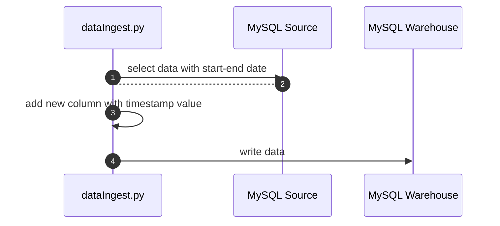

In this case, I am using MySQL as source and warehouse (only the database name is different) with a flow like below:





All configuration of this script can be seen in the file [application.conf](application.conf).

```env
{
    mysqlSource{
        host=localhost
        port=3306
        user=root
        password=example
        dbName=testdb
        tableName=transactions
    }
    
    mysqlWarehouse{
        host=localhost
        port=3306
        user=root
        password=example
        dbName=warehouse
        tableName=transactions
    }

    option{
        interval=1 #day(s)

        # set this variable to custom startDate and endDate
        startDate = '2018-01-01'
        endDate = '2018-01-02'
    }
}
```

We can custom configuration required for source and warehouse, we can also modified interval option with units of day(s), custom start date, and end date (by default start date = yesterday and end date = today).